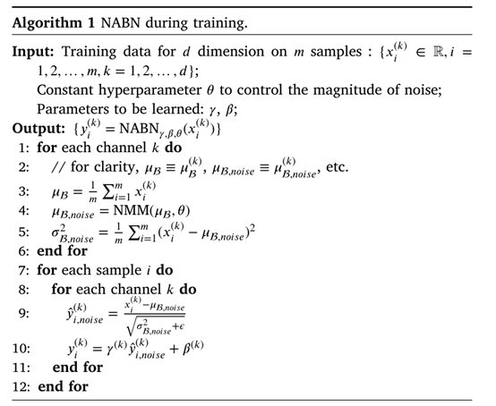
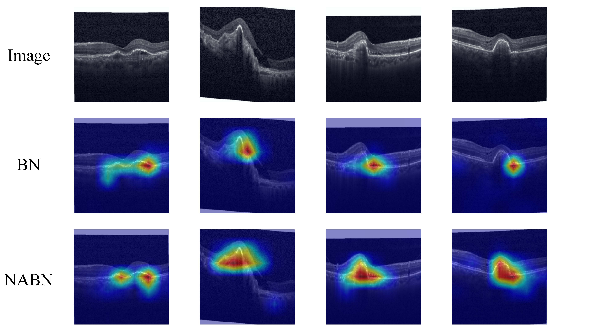

# AugmentBN

## Jittor-AugmentBN

**Jittor-AugmentBN** is a lightweight implementation of **Noise-Assisted Batch Normalization (AugmentBN)** using the Jittor deep learning framework. This project focuses on addressing the **overfitting problem in medical image analysis**, particularly when training with small batch sizes, where traditional Batch Normalization (BN) often underperforms.

### Problem Description

In deep learning, **Batch Normalization (BN)** is widely used to accelerate training and improve generalization. However, in **small-batch scenarios**, BN tends to produce **biased estimates** of mean and variance, which degrades model performance. This problem is particularly significant in **medical image analysis**, where datasets are often limited. Under such constraints, using BN can result in **unstable training** and **poor generalization** on test data.

### Method Description

To overcome this limitation, Jittor-AugmentBN introduces a novel regularization technique called **Noise-Assisted Batch Normalization (AugmentBN)**. The key idea is to inject **random noise** into the normalization process during training to simulate the effect of larger batch sizes, thereby reducing estimation bias and enhancing robustness.

#### Key Steps of AugmentBN:

1. **Random noise generation**: In each training iteration, noise is generated and added to the input features.
2. **Noisy BN statistics**: Batch normalization is applied to the **noisy input**, allowing the model to compute more robust mean and variance.
3. **Gradient flow**: The model is updated via **backpropagation**, ensuring that the introduction of noise does not hinder convergence.

<p align="center">
  
</p>

### Benefits

- Better performance in small-batch training  
- Reduced overfitting in medical image analysis  
- Maintains convergence and stability

### Grad-CAM comparison between traditional BN and our NABN on retinal OCT dataset
<p align="center">
  
</p>

## Installation

To install the library locally:

```bash
git clone https://github.com/SCU-JittorMed/Jittor-AugmentBN.git
cd NABN
pip install -e .
```

## Usage

```
from NABN.normalization import GauBatchNorm
import jittor as jt

x = jt.array([1, 2, 3])
y = jt.array([4, 5, 6])

num_features = 3
bn = GauBatchNorm(num_features)

bn(x), bn(y)

bn.is_train = False
bn(x), bn(y)
```

Explanation:

- **`num_features (int)`**: Number of input features.
- **`is_train (bool)`**: Whether to update the running mean and variance during training.

## Examples
We provide one usage example in Jupyter Notebooks under the `examples/` folder:

* For image classification on CIFAR-10, modify `net_name` in `examples/train_CIFAR_AugmentBN.py`, and run
```
python examples/train_CIFAR_AugmentBN.py
```

### Citation

```bibtex
@article{hu2020jittor,
  title={Jittor: a novel deep learning framework with meta-operators and unified graph execution},
  author={Hu, Shi-Min and Liang, Dun and Yang, Guo-Ye and Yang, Guo-Wei and Zhou, Wen-Yang},
  journal={Science China Information Sciences},
  year={2020}
}


@article{zhu2024regularizing,
  title={Regularizing deep neural networks for medical image analysis with augmented batch normalization},
  author={Zhu, Shengqian and Yu, Chengrong and Hu, Junjie},
  journal={Applied Soft Computing},
  year={2024},
}
```


